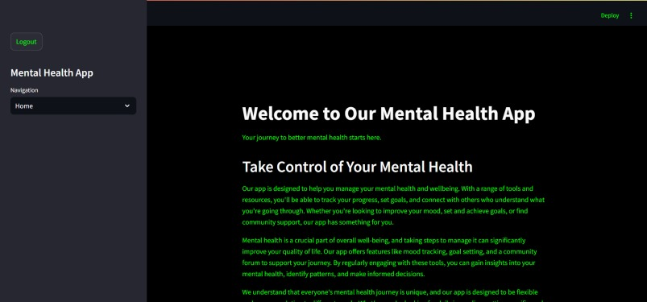
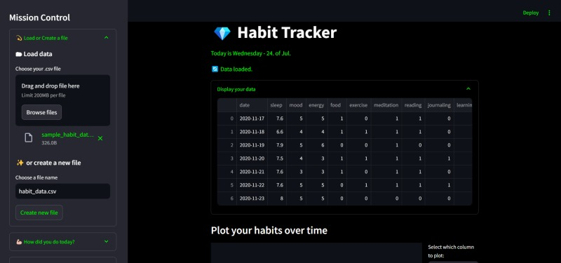
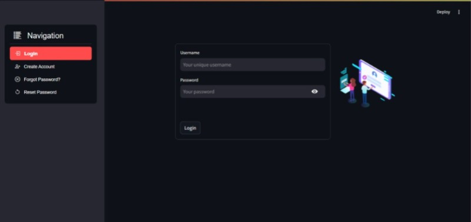
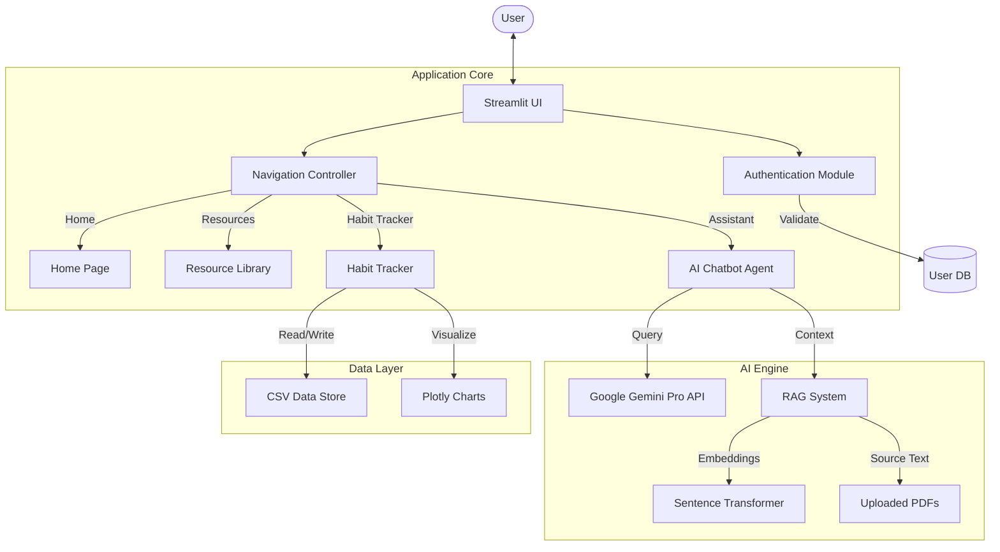

# 🧠 Mental Health Support App

A comprehensive mental well-being application built with Streamlit, offering AI-powered support, habit tracking, and curated resources to help users manage their mental health journey.

## 📸 Gallery

<div align="center">
    
    
</div>
<div align="center">
    
    
</div>

## 🛠 Tech Stack

The application leverages a robust set of modern technologies:

- **Frontend & UI**: [Streamlit](https://streamlit.io/) - For building the interactive web application.
- **Authentication**: `streamlit-login-auth-ui` - Secure user login and registration.
- **AI & NLP**:
  - **Google Gemini Pro**: Powered by `google-generativeai` for intelligent conversational support.
  - **RAG (Retrieval-Augmented Generation)**: Uses `sentence-transformers` for embeddings and `sklearn` for cosine similarity to query PDF resources.
  - **PyPDF2**: For extracting text from uploaded mental health resource PDFs.
- **Data Visualization**:
  - `plotly`: Interactive charts for habit tracking.
  - `matplotlib`: Static plotting capabilities.
- **Data Processing**: `pandas`, `numpy`.
- **Environment Management**: `python-dotenv`.

## 📂 Project Structure

```ascii
MentalHealthApp/
├── db/
│   └── chroma.sqlite3      # Vector database for efficient retrieval
├── images/
│   ├── Chat2.jpeg
│   ├── GenAI AssistantChat.jpeg
│   ├── HabitTracker.jpeg
│   ├── Home.jpeg
│   ├── Home2.jpeg
│   ├── PlotlyGraphData.png
│   ├── Resources.jpeg
│   └── UserAuthPage.jpeg
├── modules/
│   ├── data/
│   │   ├── __init__.py
│   │   └── data.py         # Data handling logic
│   ├── helper/
│   │   ├── __init__.py
│   │   └── helper.py       # Utility functions
│   ├── stats/
│   │   ├── __init__.py
│   │   └── stats.py        # Statistical analysis modules
│   └── __init__.py
├── resources/
│   ├── MiniProject_Report_6th_Sem.pdf
│   ├── sample_habit_data.csv
│   └── screenshot.png
├── user_data/
│   └── [user_uuid].json    # User-specific data storage
├── .env.example            # Environment variables template
├── .gitignore
├── _secret_auth_.json      # Authentication secrets (do not commit)
├── conversation_history.json
├── mainapp.py              # Main Streamlit application entry point
├── mental health.png       # App icon/logo
├── requirements.txt        # Python dependencies
├── rr.txt                  # Additional resource/notes
└── styles.css              # Custom CSS styling
```

## 🧩 Architecture

The following diagram illustrates the high-level architecture of the application:



## 🚀 How to Run

Follow these steps to set up and run the application locally.

### Prerequisites

- Python 3.8 or higher
- pip (Python package installer)

### Installation

1. **Clone the repository** (if you haven't already):

    ```bash
    git clone <repository-url>
    cd MentalHealthApp
    ```

2. **Create a Virtual Environment** (Recommended):

    ```bash
    python -m venv venv
    
    # Windows
    .\venv\Scripts\activate
    
    # macOS/Linux
    source venv/bin/activate
    ```

3. **Install Dependencies**:

    ```bash
    pip install -r requirements.txt
    ```

### Environment Setup

This project requires sensitive API keys to function correctly.

1. **Create the `.env` file**:
    Use the provided `.env.example` as a template. You can copy it using the command line:

    ```powershell
    # Windows PowerShell
    cp .env.example .env
    ```

    Or on Linux/macOS:

    ```bash
    cp .env.example .env
    ```

2. **Configure `.env`**:
    Open the newly created `.env` file and fill in your keys:

    ```ini
    # .env
    GENAI_API_KEY=your_actual_gemini_api_key_here
    AUTH_TOKEN=your_auth_token_here
    LOTTIE_URL=https://assets5.lottiefiles.com/packages/lf20_fcfjwiyb.json
    ```

    > **Note**: Get your Gemini API key from [Google AI Studio](https://makersuite.google.com/).

### Running the App

Once setup is complete, launch the application using Streamlit:

```bash
streamlit run mainapp.py
```

The app should automatically open in your default browser at `http://localhost:8501`.

## ⚠️ Important Troubleshooting & Configuration Notes

If you encounter issues (specifically with the `streamlit-login-auth-ui` library), please manually apply the following fixes to the library files or local modules:

### 1. Library Fixes (`streamlit-login-auth-ui`)

You may need to ctrl+click these function names in your IDE to navigate to the source files (e.g., `EncryptedCookies.py`, `__login__.py`, etc.).

- **`EncryptedCookies.py`**:
  - Locate the import for `_login_`.
  - Change `st.cache` to **`st.cache_data`** (to support newer Streamlit versions).
- **Imports (in `_login_` and `.utils`)**:
  - Replace: `from trycourier import Courier`
  - With: **`from courier.client import Courier`**
- **`__login__.py`**:
  - **Remove** any usage of `st.rerun_experimental()`.

### 2. Configuration

- **`authpage.py`**: Ensure you provide a valid `auth_token`. You can generate this token at [Courier Email API](https://www.courier.com/email-api/).

### 3. Resources Folder

The `resources/` folder contains essential project assets:

- **Mini Project Report**: Documentation and details about the project.
- **Sample Data**: A `.csv` file for testing the **Habit Tracker** section.
